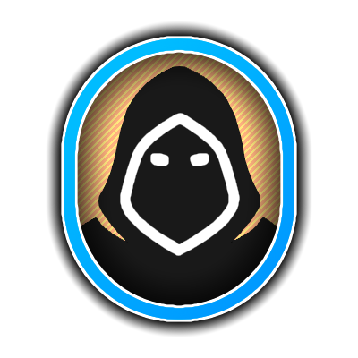
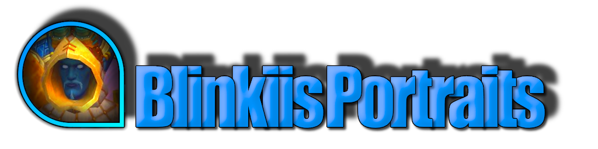

# Blinkiis Portraits

  

  Add stylized 2D portraits to supported World of Warcraft unit frames with flexible positioning,
  class icons, overlay textures, and shareable profiles.

  <a href="https://www.curseforge.com/wow/addons/blinkiis-portraits">CurseForge</a>
  |
  <a href="https://github.com/mBlinkii/Blinkiis-Portraits/issues">Bug Reports</a>
  |
  <a href="https://github.com/mBlinkii/Blinkiis-Portraits/issues">Feature Requests</a>
  |
  <a href="https://discord.gg/AE9XebMU49">Discord</a>

## Overview

**Blinkiis Portraits** is a lightweight customization addon that adds portrait elements to popular
unit frame addons and Blizzard-style frames. It is built for players who want their UI to feel more
personal, more readable, and a lot less generic.

The addon can automatically detect compatible unit frames or let you choose the parent frame
manually per unit type. Once attached, each portrait can be customized independently.

Current repository version: **1.50**  
Latest changelog entry: **2026-04-20**

## Highlights

- Supports portraits for `player`, `target`, `focus`, `target of target`, `pet`, `party`, `boss`, and `arena` where the selected frame addon provides those unit frames.
- Works with multiple unit frame ecosystems, including Blizzard-style frame replacements and addon-specific layouts.
- Includes a broad portrait style library with classic, geometric, mirrored, and decorative shapes.
- Adds optional extra textures for rare, elite, boss, and player states.
- Supports class icon display with multiple built-in styles and custom class icon packs.
- Lets you use custom portrait textures, masks, and extra masks from your own files.
- Offers per-unit settings for size, anchor point, layer, frame level, mirroring, cast icon display, and color behavior.
- Includes profile export/import so setups can be backed up and shared.
- Ships with localization files for multiple languages.

## Supported Unit Frame Addons

The addon currently includes integrations for:

- `ElvUI`
- `Shadowed Unit Frames`
- `PitBull 4`
- `Cell`
- `Cell Unit Frames`
- `Unhalted Unit Frames`
- `NDui`
- `EnhanceQoL`
- `BetterBlizzFrames`
- `EllesmereUI`

Coverage depends on what each frame addon exposes. For example, some integrations support party and
arena frames, while others only expose single-unit frames.

## Supported Game Clients

The repository includes separate TOC files for Retail and multiple Classic client variants.

## Customization Features

- Portrait shapes such as Blizzard-style, circular, diagonal, leaf, moon, oval, rectangular, shield, trapezoid, and more
- Decorative overlays for themes like dragon, snake, plants, stars, dogs, space, and Blizzard-style elite or boss borders
- Reaction- and classification-based coloring or overlay handling
- Optional desaturation and zoom controls
- Manual parent frame selection when multiple unit frame addons are installed
- Custom class icon registration
- Per-unit option to ignore class icons and keep regular portraits instead

## Localization

Localization files are currently included for:

- `enUS`
- `deDE`
- `esMX`
- `frFR`
- `itIT`
- `koKR`
- `ptBR`
- `ruRU`
- `zhCN`
- `zhTW`

## Installation

1. Download the addon from [CurseForge](https://www.curseforge.com/wow/addons/blinkiis-portraits).
2. Extract the `Blinkiis_Portraits` folder into your WoW `Interface/AddOns` directory for the client you play.
3. Start the game or reload your UI.
4. Open the configuration with `/bp`.

## Configuration

You can access the addon settings in two ways:

- Type `/bp`
- Open `Game Menu -> Options -> AddOns -> Blinkiis Portraits`

If you use more than one compatible unit frame addon at the same time, select the desired parent
frame per unit inside the addon options.

## Profiles and Sharing

Blinkiis Portraits includes built-in profile management features:

- Export profiles as a shareable string
- Import profiles from other users
- Store optional profile metadata such as author, name, and version

This makes it easy to keep personal presets, share layouts with friends, or bundle recommended
profiles for specific UI setups.

## Recent Changes

Version `1.50` adds support for `EllesmereUI` and `BetterBlizzFrames`, and includes several fixes
for profile structure, boss portrait initialization, and portrait update behavior.

For the full history, see [CHANGELOG.md](./CHANGELOG.md).

## Contributing

Feedback, bug reports, and feature ideas are welcome:

- Open an issue on [GitHub](https://github.com/mBlinkii/Blinkiis-Portraits/issues)
- Share feedback on [Discord](https://discord.gg/AE9XebMU49)

If you enjoy the addon, starring the repository helps a lot.

## License

This project is **All rights reserved**. See [LICENSE.txt](./LICENSE.txt) for details.
